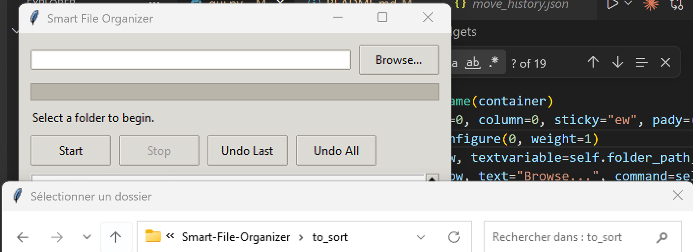
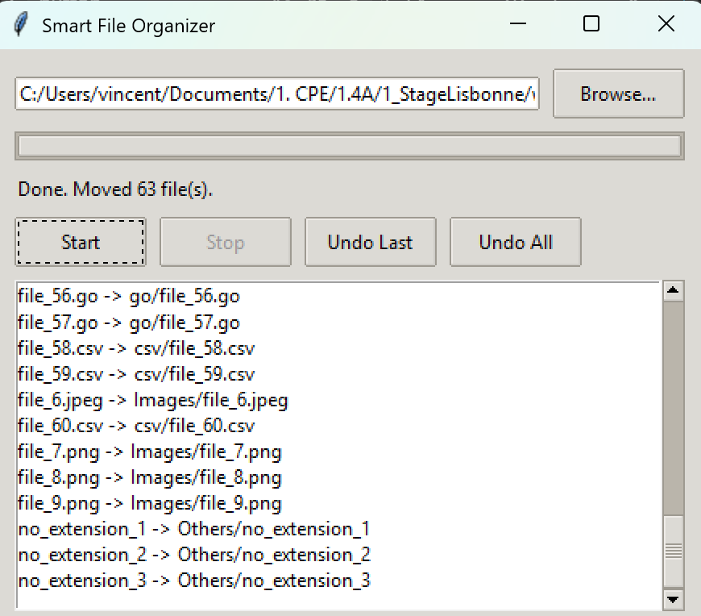

# Smart File Organizer

A small Python tool that automatically sorts the files in a folder into subfolders based on their extension (e.g. `.jpg` -> `Images/`, `.pdf` -> `Documents/`). Extensions that aren't explicitly known get their own folder named after the extension (e.g. `.rs` -> `rs/`). Written in OOP, it ships with both a console menu and a Tkinter GUI.

## Features

- Scans a folder and classifies files by extension into category subfolders (Images, Documents, Audio, Videos, Archives, Code, or the extension's own folder).
- Creates destination folders and moves files with `shutil.move()`.
- Resolves filename conflicts automatically (renames to `name (1).ext`, etc.) and handles permission errors without crashing - failed files are logged and skipped.
- Logs every move (source, destination, timestamp, status) to `organizer_log.csv`.
- Keeps a persistent move history (`move_history.json`) so the last move, or all moves, can be undone.
- Console menu (`cli.py`) and a Tkinter GUI (`gui.py`) with folder selection, progress bar, start/stop, and undo buttons.

## Project Structure

- [file_organizer.py](file_organizer.py) - core classes: `FileScanner`, `FileClassifier`, `MoveLogger`, `MoveHistory`, `FileOrganizer`.
- [cli.py](cli.py) - console menu entry point.
- [gui.py](gui.py) - Tkinter GUI entry point.
- [generate_test_files.py](generate_test_files.py) - dev utility that fills a folder with sample files to test the organizer.

## Getting Started

### Requirements

- Python 3.9+ (standard library only, no third-party packages needed).
- For the GUI on Linux, Tk bindings may need to be installed separately: `sudo apt install python3-tk` (Debian/Ubuntu) or `sudo dnf install python3-tkinter` (Fedora/RHEL). Windows and macOS installers from python.org include Tk by default.

### Installation

Clone this repository (or download the files) - there is nothing else to install.

## Usage

**Console menu**

```
python cli.py
```

Choose to organize a folder, undo the last move, undo all moves, or exit.

**Graphical interface**

```
python gui.py
```

Click "Browse..." to pick a folder, "Start" to organize it, "Stop" to interrupt mid-run, and "Undo Last" / "Undo All" to revert.

**Generate sample files to try it out**

```
python generate_test_files.py [folder]
```

Fills `folder` (defaults to `to_sort/`) with ~60 sample files across every category, including a few unhandled extensions, ready to be organized.

## Logs and History

- `organizer_log.csv` - one row per moved or failed file: timestamp, source, destination, status.
- `move_history.json` - records used by undo; deleting it clears the undo history.

Both files are created next to wherever the script is run from, and are git-ignored.

## Screenshots



